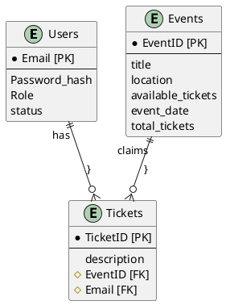

```plantuml
@startuml

entity Users {
  * Email [PK]
  --
  Password_hash
  Role
  status
}

entity Tickets {
  * TicketID [PK]
  --
  description
  # EventID [FK]
  # Email [FK]
}

entity Events {
  * EventID [PK]
  --
  title
  location
  available_tickets
  event_date
  total_tickets
}

Users ||--o{ Tickets : "has"}
Events ||--o{ Tickets : "claims"}

@enduml

```