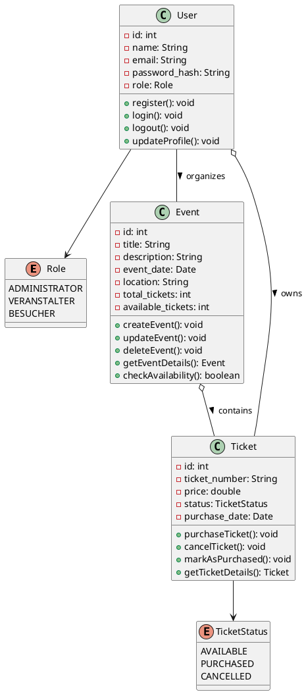

```plantuml
@startuml

enum Role {
  ADMINISTRATOR
  VERANSTALTER
  BESUCHER
}

enum TicketStatus {
  AVAILABLE
  PURCHASED
  CANCELLED
}

class User {
  - id: int
  - name: String
  - email: String
  - password_hash: String
  - role: Role
  + register(): void
  + login(): void
  + logout(): void
  + updateProfile(): void
}

class Event {
  - id: int
  - title: String
  - description: String
  - event_date: Date
  - location: String
  - total_tickets: int
  - available_tickets: int
  + createEvent(): void
  + updateEvent(): void
  + deleteEvent(): void
  + getEventDetails(): Event
  + checkAvailability(): boolean
}

class Ticket {
  - id: int
  - ticket_number: String
  - price: double
  - status: TicketStatus
  - purchase_date: Date
  + purchaseTicket(): void
  + cancelTicket(): void
  + markAsPurchased(): void
  + getTicketDetails(): Ticket
}

' --- Relationships ---
User --> Role
Ticket --> TicketStatus

' Association: User ↔ Event
User -- Event : organizes >

' Aggregation: Event ◇─ Ticket
Event o-- Ticket : contains >

' Aggregation: User ◇─ Ticket
User o-- Ticket : owns >

@enduml


```